# задание 1.1 

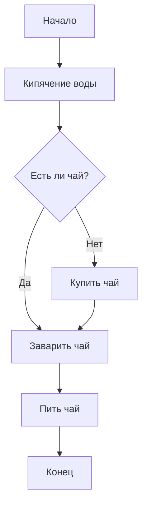

# задание 1.2

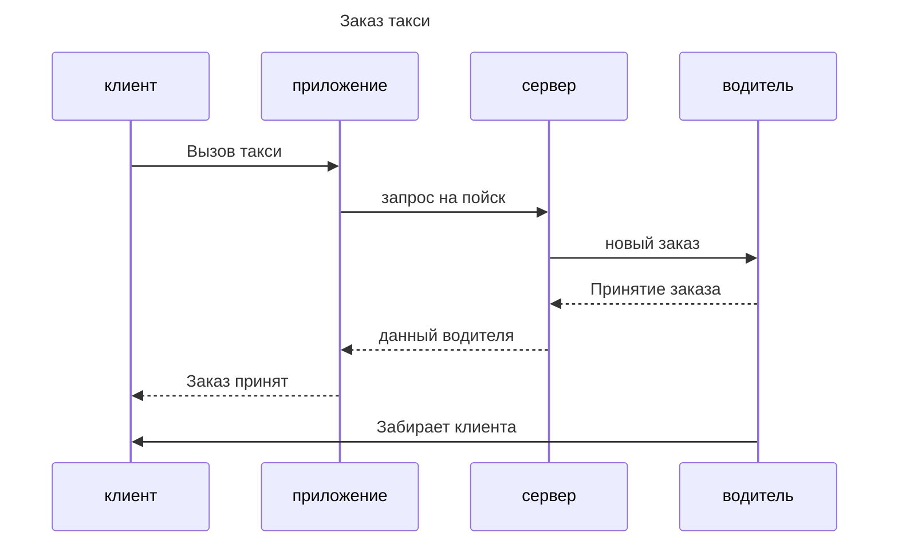

# задание 2.1

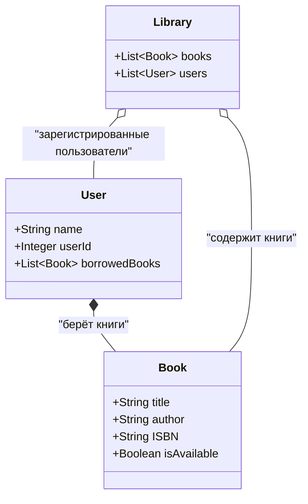

 # задание 2.2

 ```mermaid
    gantt
    title Разработка мобильного приложения
    dateFormat  YYYY-MM-DD
    section Preparation
    Preparation          :a1, 2025-11-01, 5d
    section Design
    Design               :after a1, 7d
    section Frontend
    Frontend             :after a1, 10d
    section Backend
    Backend              :after a1, 12d
    section Testing
    Testing              :after Frontend, 5d
```

# задание 3.1

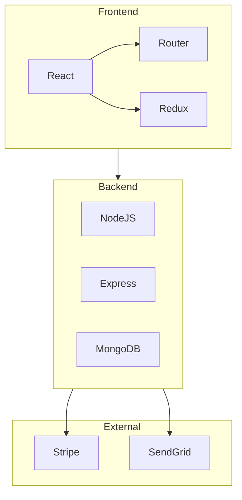

# задание 3.2

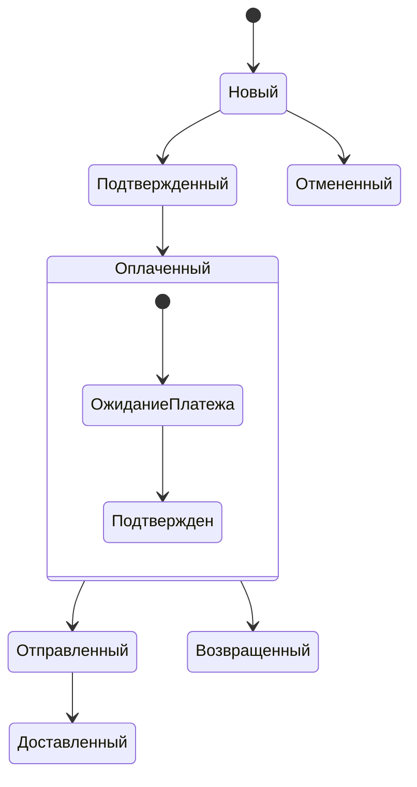

# задание 4.1

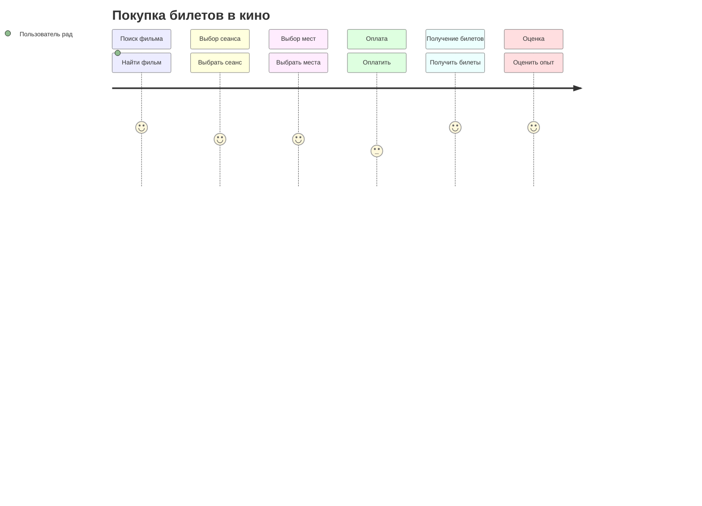

# задание 4.2

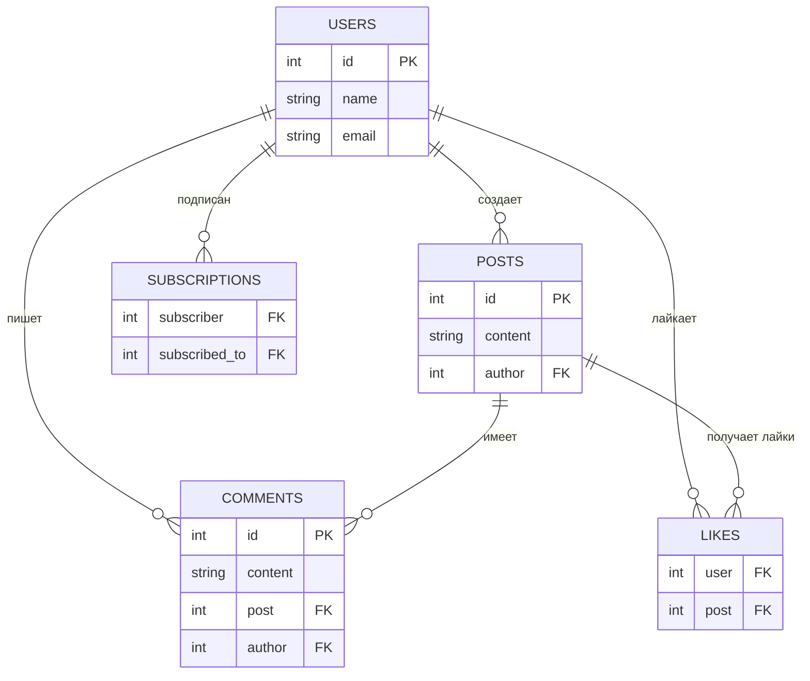

# задание 5

# 📦 Сервис доставки еды – Полная документация
## 1. Блок-схема процесса заказа
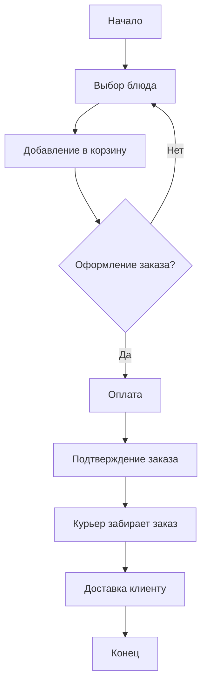
## 2. Диаграмма последовательности
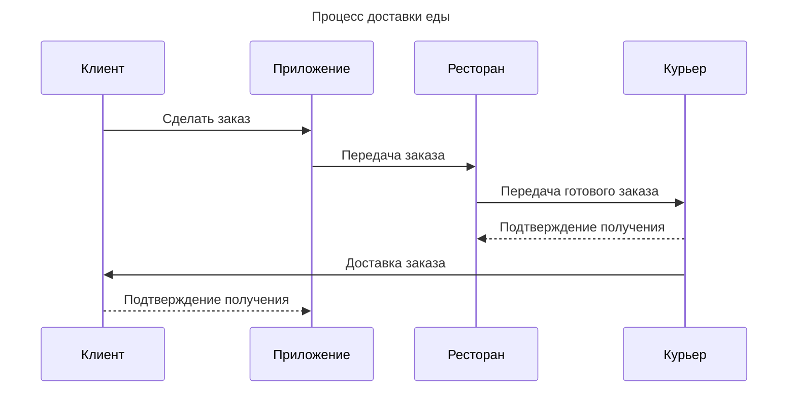
## 3. Диаграмма классов
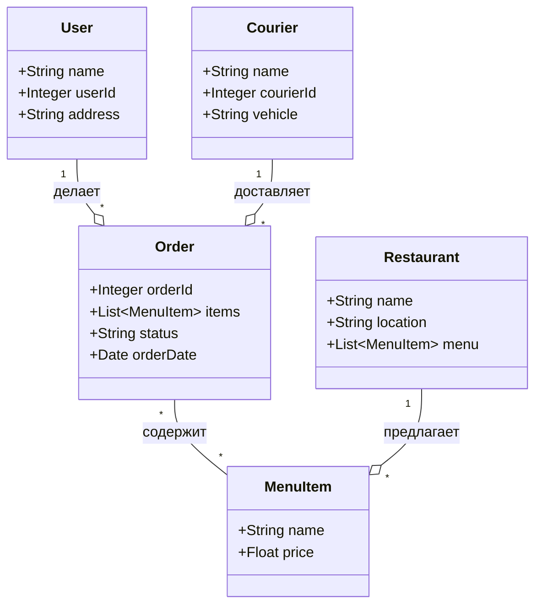
## 4. ER-диаграмма базы данных
```mermaid
erDiagram
    USERS {
        int id PK
        string name
        string address
    }
    ORDERS {
        int id PK
        int user_id FK
        int restaurant_id FK
        string status
        date order_date
    }
    MENU_ITEMS {
        int id PK
        string name
        float price
        int restaurant_id FK
    }
    RESTAURANTS {
        int id PK
        string name
        string location
    }
    COURIERS {
        int id PK
        string name
        string vehicle
    }

    USERS ||--o{ ORDERS : делает
    RESTAURANTS ||--o{ MENU_ITEMS : предлагает
    RESTAURANTS ||--o{ ORDERS : принимает
    COURIERS ||--o{ ORDERS : доставляет
```
## 5. User Journey клиента
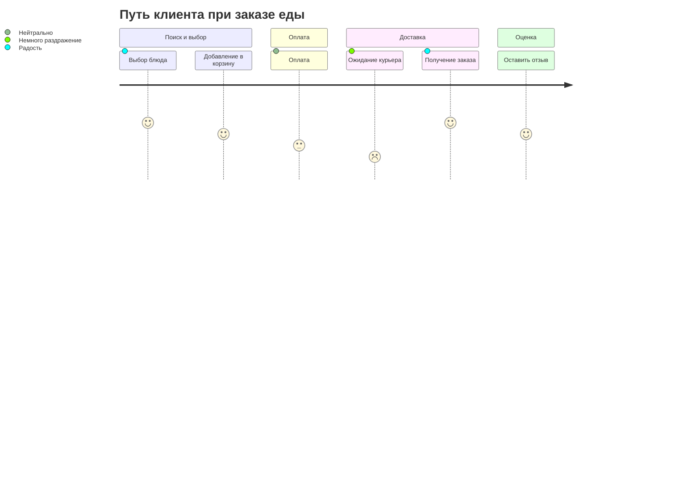
## 6. Диаграмма Ганта разработки проекта
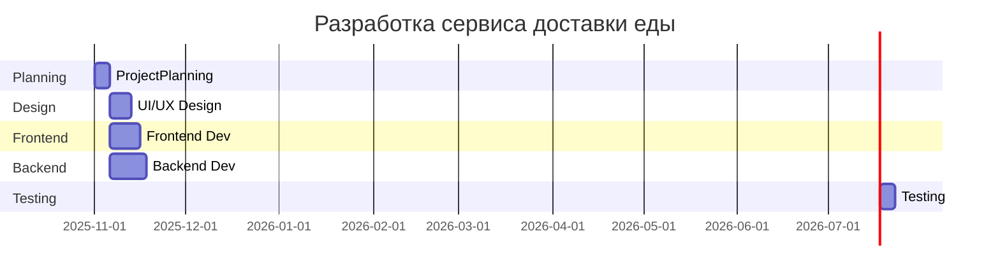

# задание 6

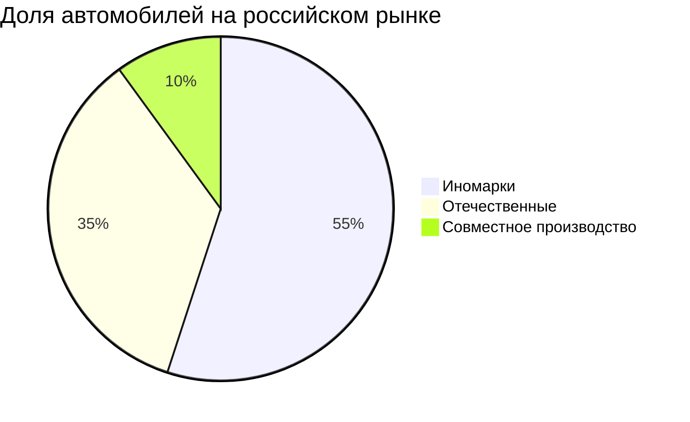

 
 
